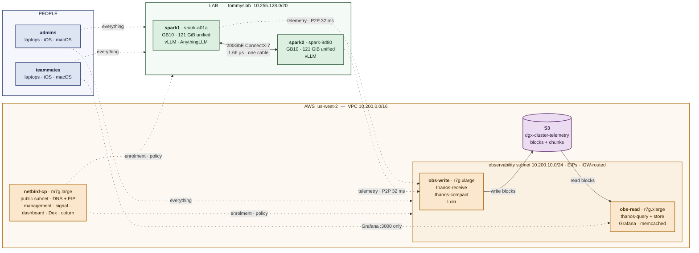
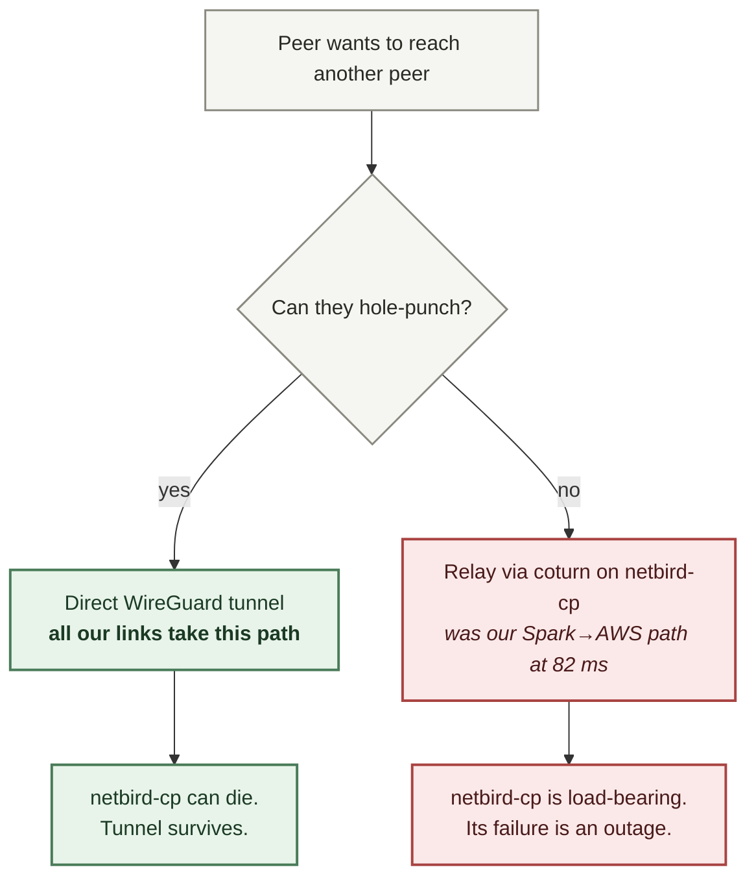
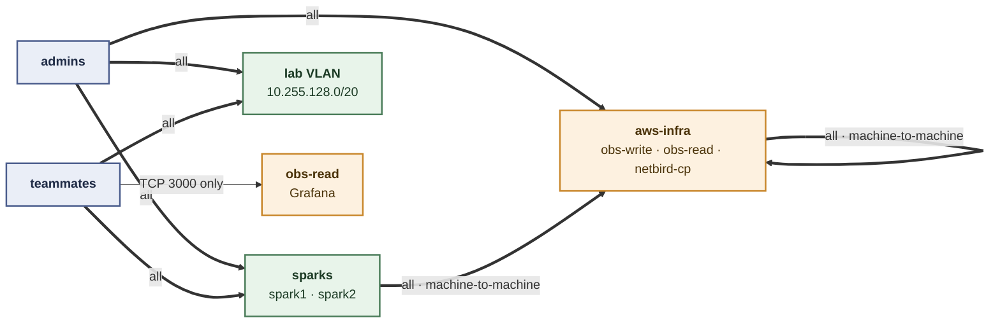
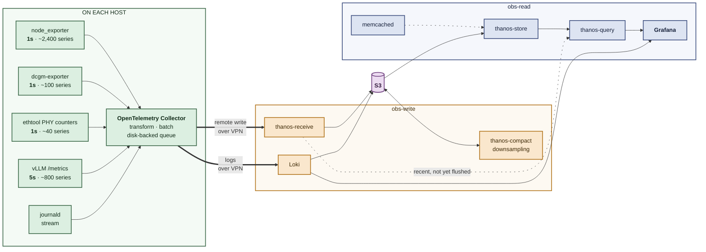
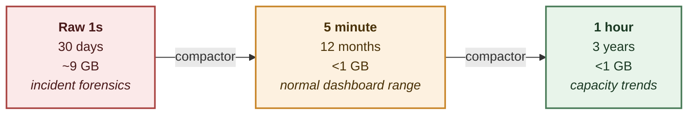

# Cloud architecture: VPN and observability

Design for the AWS side of the cluster, agreed 2026-08-27, **built 2026-09-02**
and **verified 2026-09-03**. Operational addresses are in `ACCESS.md`; build
steps are in `RUNBOOK.md` sections 11-15.

Two related goals. Ship all logs and metrics from the Sparks to a
long-retention store with a fast Grafana front end, and give people remote
access to both the lab and the cloud without exposing either to the internet.

Region us-west-2. All infrastructure new. Open source throughout — no AWS
proprietary networking or observability services.

| Layer | Choice | State |
|---|---|---|
| VPN | NetBird, self-hosted, single control-plane node | built |
| Metrics | Thanos with S3 backend | built, 18 targets up |
| Logs | Loki with S3 backend | built |
| UI | Grafana 13.0.8, three provisioned dashboards | built |
| Agent | OpenTelemetry Collector on each host | built, 4 hosts |
| Retention | 12 months, expanding to 3 years | configured |
| Cost | ~$286/month | running |

---

## The whole thing on one page



Solid lines are the fast paths that carry bulk data. Dotted lines are overlay
traffic. **Every link is a direct WireGuard tunnel** — netbird-cp brokers the
connections but does not carry them, so losing it does not stop telemetry or
dashboards.

---

## Network plan

| Range | Use |
|---|---|
| `10.200.0.0/16` | AWS VPC |
| `10.200.10.0/24` | Observability subnet |
| `100.123.0.0/16` | NetBird overlay, allocated from `100.64.0.0/10` |
| `10.255.128.0/20` | Lab VLAN, tommyslab, UniFi Dream Machine |
| `192.168.100.0/24`, `192.168.101.0/24` | Spark interconnect, private cable |
| `172.17.0.0/16` | Docker on the Sparks |

No overlaps. Confirm before changing any of them.

---

## VPN

NetBird, self-hosted. Both clients and control plane are BSD-3 licensed, with
first-party clients for Linux, macOS, iOS, Android and Windows. Since v0.65 the
server ships as a single container.

Note on naming: NetBird's "Public API" means publicly documented, not publicly
hosted. Self-hosted it runs on our management server. Nothing reaches
netbird.io.

### Why the control plane is not in the data path



Getting onto the green path was the single most valuable change in the build.
See "What the build changed" below.

The lab VLAN is reached differently, because the UDM and other lab hosts cannot
run a client. Both Sparks advertise `10.255.128.0/20` as a network route under
one `network_id`, so NetBird fails over between them and rebooting one does not
remove lab access.

### Access policy



Teammates get full lab access and exactly one port in the cloud. That policy
targets the `obs-read` peer, **not** the `aws-infra` group — scoping it to the
group would permit port 3000 on any AWS host.

The two `machine-to-machine` edges are the ones that get forgotten. Nobody logs
into those paths, so their absence produces no error anywhere; it just takes
telemetry to zero the moment the All-to-All default is disabled.

### Automation

The whole access model is declarative in
`ansible/roles/netbird_config/defaults/main.yml` and applied with:

```bash
cd ansible && ansible-playbook netbird-access.yml
```

It runs against the API from localhost, needs no managed host, and converges to
`changed=0`. Groups, setup keys, policies, routes and the lockdown are all in
that one file. There are no configuration shell scripts.

Setup keys are the mechanism for onboarding a machine without a human in the
dashboard. Identity starts with the embedded Dex; any OIDC provider can replace
it later without redesign.

---

## Observability

### Pipeline



Roughly 3,440 series and 88.3 billion samples a year. Ingest is 2,800
samples/second, which is small; **the scale problem is query, not write.**

Push, not pull: collectors write outward, so nothing needs inbound access to
the lab. The collector's on-disk queue means a network outage delays telemetry
rather than losing it.

vLLM is scraped at 5s rather than 1s because its metrics handler runs inside
the serving process, and 60 invocations a minute against a node already at 105
of 121 GiB risks perturbing the thing being measured.

Traces are deliberately out of scope for v1. vLLM's OTLP support needs
verifying, and with two nodes and no distributed call graph the insight does
not justify the complexity.

### Retention: why Thanos

Thanos rather than Mimir, specifically for automatic multi-resolution
downsampling.



The arithmetic that forces this: a one-year query over raw 1s data is **31.5
million points per series**; against 5-minute rollups it is about **105,000**.
No instance size fixes a 300x difference. Hand-written recording rules only
cover metrics anticipated in advance, which leaves ad-hoc exploration slow —
and ad-hoc exploration is the entire point of keeping three years.

Thanos picks the resolution per query, so a year-long dashboard stays fast
without anyone thinking about it.

Storage is dominated by the 30-day raw window. With logs, the whole thing is
about 55 GB in S3, roughly $2 a month.

**An S3 Gateway VPC Endpoint is required, not optional.** It is free, and it
keeps every block flush and chunk fetch on the AWS backbone rather than going
out through the internet gateway and back.

### Why read is split from write

The reason is compaction, not ingest. Building 5-minute and 1-hour rollups from
88 billion raw samples a year is bursty and CPU-hungry. On a single node that
work would land on top of queries and make dashboards intermittently sluggish.

Splitting also means a pathological query cannot stall ingest and drop samples,
and the query side can be restarted without losing metrics.

Both nodes sit in the same AZ, so there are no cross-AZ transfer charges and
inter-node latency is sub-millisecond.

### Dashboards

| Dashboard | uid | Panels | Answers |
|---|---|---|---|
| vLLM and Qwen performance | `vllm-qwen` | 20 | Is inference fast, and if not, why |
| Fleet health | `fleet` | 11 | Are the nodes healthy |
| Observability stack health | `obs-self` | 10 | Is the telemetry pipeline itself healthy |

Provisioned from `ansible/roles/observability/files/dashboards/`. Start at
`obs-self` when a panel looks wrong: a flat line is more often a dropped scrape
than a real change on the node.

---

## Instances

| Node | Placement | Roles | Spec | Monthly |
|---|---|---|---|---|
| netbird-cp | public subnet, EIP + DNS | management, signal, dashboard, Dex, coturn | m7g.large | ~$43 |
| obs-write | obs subnet, EIP | Thanos receive, compactor, Loki | r7g.xlarge | ~$98 |
| obs-read | obs subnet, EIP | Thanos query + store, Loki read, Grafana, memcached | r7g.xlarge | ~$98 |
| EBS | | 300 + 150 + 30 GB gp3 | | ~$38 |
| Elastic IPs | | 3 attached | | ~$7 |
| S3 | | growing to ~55 GB | | ~$2 |
| **Total** | | | | **~$286** |

netbird-cp is non-burstable deliberately: a t-class instance exhausting CPU
credits would degrade NAT traversal and relay together.

Everything durable is in S3, so instances are disposable and resizing is a
stop-change-start.

All resources carry `createdBy = tommy.aldo.sonin` via `default_tags`.

---

## What the build changed

Recorded because each of these differed from the design.

### The observability nodes had to leave the private subnet

This is the important one. The design put obs-write and obs-read behind
netbird-cp acting as a NAT instance. WireGuard hole punching **cannot work**
through that, because Linux `MASQUERADE` does endpoint-dependent filtering: it
silently drops the inbound hole-punch packet that has not been solicited by a
prior outbound packet to that exact endpoint.

The consequence was that Spark-to-AWS fell back to relaying through coturn, at
82 ms against the ~30 ms expected direct, with netbird-cp sitting in the
telemetry data path.

The fix was to give both nodes Elastic IPs and route the subnet through the
internet gateway, while keeping the security group closed to everything except
UDP 51820:

| | Before | After |
|---|---|---|
| Egress path | NAT via netbird-cp | Internet gateway |
| Public address | none | Elastic IP |
| Inbound allowed | none | UDP 51820 only |
| Spark→AWS connection | `Relayed` | `P2P`, `srflx/srflx` |
| Spark→AWS latency | 82 ms | **32 ms** |
| netbird-cp in data path | yes | no |

SSH and Grafana remain overlay-only. The subnet is still named `private` in
the Terraform; the name is now wrong and the comment in `vpc.tf` says so.

This also removed the justification for netbird-b, which had been built for
relay redundancy and was then destroyed.

### The rest

**Docker breaks NAT instances.** Docker sets the FORWARD policy to DROP when it
starts, so private-subnet packets die before reaching the masquerade rule. The
NAT rule then shows a zero packet count and looks correct. Rules must go in
`DOCKER-USER`, which Docker evaluates first and never rewrites. Those rules are
still on netbird-cp but are now vestigial, since nothing routes through it.

**thanos-receive binds a port no flag mentions.** It listens on the
remote-write port plus 100 (19391) for remote-write gRPC. Anything else placed
there fails with a bare "address already in use". The compactor now uses 10903.

**Container uids differ per image**: thanos 1001, loki 10001, grafana 472. Data
directories must match or the container crash-loops on permission denied.

**Grafana datasources need explicit, stable uids.** Provisioned dashboards
reference them, and Grafana refuses to start if a uid changes under it —
"data source not found". A `deleteDatasources` stanza removes them by name
first, making the change safe and a no-op on a fresh install.

**Datasource URLs must be `127.0.0.1`, not Compose service names.** These
containers run `network_mode: host`, so Docker's embedded DNS does not resolve
`thanos-query`. This broke every metric panel and surfaced as a Drilldown
plugin error rather than a connection failure.

**The journald receiver puts the whole entry in the log body**, not in
attributes, so a transform is required both to set `service.name` from the
systemd unit and to reduce the body to the message. Without it every log lands
as `unknown_service` and renders as a JSON blob.

**Rosenpass strict mode locks out peers.** A client with rosenpass enabled
refuses peers that do not support it, reporting `remote peer does not support
rosenpass` and connecting to nothing. It is a per-client setting:
`netbird up --enable-rosenpass=false`.

**NetBird policy `ports` must be strings.** Integers are rejected with a null
body and HTTP 200, so the failure looks exactly like success.

**vLLM renamed its cache metric** to `vllm:kv_cache_usage_perc`, from
`gpu_cache_usage_perc`.

**vLLM's `--api-key` is `nargs='+'`, not repeatable.** Passing the flag once
per client keeps only the last value; every other client gets 401, and nothing
at startup says so. All keys go on one flag.

**API keys are not a perimeter for vLLM.** They guard `/v1`, `/v2` and
`/inference` only — `/invocations` exposes the same inference unauthenticated.
The published port is therefore also restricted by source CIDR in DOCKER-USER,
which is what actually closes the gap. Both Ethernet networks are excluded;
clients join the VPN.

**Loki indexes only a default set of OTLP resource attributes.** `node` was not
among them, so every log stream carried `service_name` alone and `{node="..."}`
matched nothing without error. Fixed with an `otlp_config.resource_attributes`
block promoting `node` and `host.name`.

**vLLM exposes prefill time and time-to-first-token as separate histograms**,
and they are not interchangeable: TTFT includes queue time, prefill does not.
The dashboard's TTFT panel was querying `vllm:request_prefill_time_seconds`
and under-reporting whenever a request waited. It now uses
`vllm:time_to_first_token_seconds`.

**Latency panels need a rate window wider than the request interval.** At a
handful of requests a day, `rate(...[5m])` is empty almost always, and
`histogram_quantile` of an empty histogram is `NaN` — which looks like a broken
panel rather than an idle cluster. The window is now a dashboard variable
defaulting to 15m.

---

## What losing netbird-cp costs

Established WireGuard tunnels are peer-to-peer and survive. Grafana stays
reachable and telemetry keeps flowing, because every link is direct.

What stops: new enrolments, policy changes, re-establishment after a peer
reboots or changes network, and relayed connections for any future peer that
cannot hole-punch.

Recovery is OpenTofu plus Ansible plus an Elastic IP move, roughly ten minutes,
with no DNS wait.

---

## Decided against

**Amazon Managed Service for Prometheus.** Retention is configurable to 1095
days, so the 150-day default was not the blocker — cost was. At 1s resolution,
13.1 billion samples a month lands near $570/month in ingest charges alone,
recurring forever, against about $2/month for the same data in S3.

**Amazon Managed Grafana with CloudWatch Logs.** Competitive on price at 15s
resolution, but CloudWatch Logs Insights is a materially worse debugging
experience than Loki with Grafana Explore, and logs are where failures actually
surface.

**Firezone.** Its control plane is hosted-only for production, which fails the
open-source requirement.

**Headscale.** Works, and the Tailscale clients are excellent, but user
management is CLI-first and the web UIs are third-party projects.

**NetBird active-active control plane HA.** Not available open source; it is an
enterprise-license feature. A community Redis-based fork exists, but running a
fork of the component whose failure locks you out of everything is a bad trade.

**A second netbird node.** Built, then destroyed. Its value was relay
redundancy, and the EIP change removed the relay dependency entirely. Do not
rebuild it without new evidence.

**Managed NAT gateway.** Never needed once the observability nodes moved to
Elastic IPs. S3 is on a gateway endpoint and apt/Docker pulls go out via the
internet gateway.

**Uniform 1s scraping.** vLLM is 5s for the reason above.

**A `sparks-to-sparks` policy.** The Sparks share a LAN and a 200GbE cable;
routing between them over the overlay would only add a hop. They correctly show
each other as absent from their peer lists.

---

## Open items

- **PagerDuty.** No work now; Grafana Unified Alerting has a native contact
  point, so enabling it later is a routing key rather than a redesign.
- **Alert rules.** None defined yet. The dashboards exist; nothing pages.
- **Rename the `private` subnet** in Terraform to match what it now does.
- **`ms_api_key`.** The vLLM endpoints are unauthenticated. Tracked in
  `NEXT_STEPS.md`.
